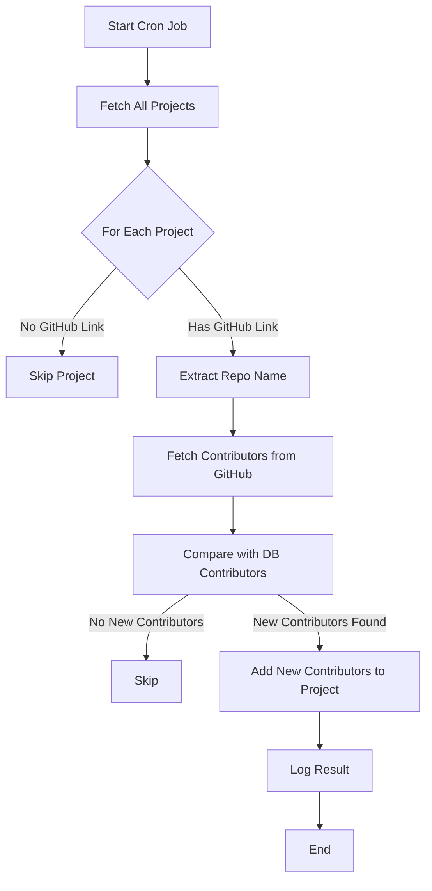

## Contributor Cron Job Workflow

The flowchart below illustrates the workflow of the contributor CRON job done in `src/jobs/contributor.cron.ts`. The job runs periodically every day at midnight (00: 00) to update the list of contributors for each project in the database by fetching data from GitHub.

